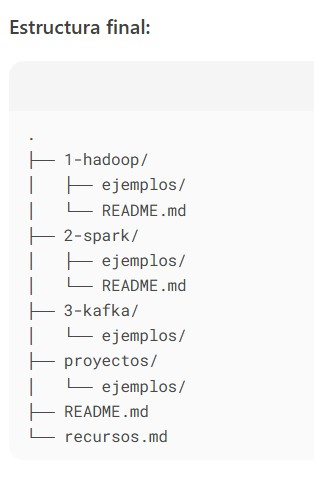

# big-data-learning     

Resumen Ordenado para Aprender Big Data y Hadoop
1. Introducción a Hadoop
Hadoop inició la revolución del Big Data, permitiendo procesar grandes volúmenes de datos de forma distribuida.

Componentes principales:

HDFS: Almacenamiento distribuido.

MapReduce: Procesamiento paralelo (divide tareas en map y reduce).

YARN: Gestor de recursos del cluster.

2. Tecnologías Clave en el Ecosistema Hadoop
Apache Spark:

Alternativa más rápida a MapReduce (procesamiento en memoria).

Incluye APIs de bajo/alto nivel (PySpark), Spark SQL, y optimizaciones como caching.

Proyectos prácticos para extraer y analizar datos.

Hive:

Datawarehouse que permite consultas con lenguaje SQL-like (HQL).

Kafka:

Procesamiento de datos en tiempo real (streaming).

Databricks:

Plataforma optimizada para Spark, ampliamente usada en la industria.

3. Herramientas Adicionales
Docker: Para empaquetar y desplegar entornos de Big Data.

Airflow: Orquestación de pipelines de datos (ej. con Astro Cloud).

Azure Data Services:

Azure Data Factory, ADLS Gen2, Synapse, y Databricks en la nube.

4. Plataformas en la Nube para Practicar (Gratis)
Google Cloud (Dataproc): $300 en créditos por 90 días.

AWS (EMR): 12 meses gratis en instancias básicas.

Azure: $200 en créditos por 30 días.

Databricks Community Edition: Versión gratuita con registro.

5. Enfoque del Aprendizaje
Práctico: Proyectos reales (ETL, streaming, pipelines).

En la nube: Evita configuraciones locales complejas.

Desde lo básico: Arquitectura, configuración y optimización.

6. Flujo Recomendado
Hadoop (HDFS + MapReduce + YARN) → 2. Spark → 3. Kafka (streaming) → 4. Airflow (orquestación) → 5. Databricks/Azure.

Nota clave: El conocimiento de Hadoop y Spark es fundamental para entrevistas y entender tecnologías modernas.

# GIT HUB REPOSITORO---Documentación  
( Ejemplo del inicio y creación de estructura de carpetas)
Paso 1.  
Crear en github.com/new.  
a) Nombre: big-data-learning (nombre de repositorio).  
b) "Add a README file" (opcional, pero útil).  
c) "Create repository".  

Paso 2.  
Clonar repositorio local  

git clone https://github.com/nilyeh/big-data-learning.git  
cd big-data-learning  

Paso 3.  
Estructura Recomendada del Repositorio  
Crea estas carpetas y archivos dentro de big-data-learning:  

código bash:  
mkdir -p {1-hadoop,2-spark,3-kafka,proyectos}/ejemplos  
touch README.md 1-hadoop/README.md 2-spark/README.md recursos.md  
$ mkdir -p docs/imagenes  # Crea la carpeta si no existe  
git add docs/imagenes/mi-imagen.png # mi-imagen.png = estructura 1.jpg    
git commit -m "Agregar imagen para README"  
git push origin main  

3.2. Insertar la imagen en el README.md  
Opción A: Markdown (recomendado)  
 

Nota: la imagen se inserta directo en el Readme.md.  
Usa rutas relativas (desde la raíz del repositorio), no absolutas  
En este ejemplo de inserción de imagen, no se incluye la carpeta docs que contiene las imagenes**  
codigo:    

[""]: <> ("")
[comment]: <> (NO MODIFICAR ESTA SECCIÓN MANUALMENTE)
[comment]: <> (---------------------------------)

<!-- 
""
-->  
[/ "" /]:  

[//]: # (Este es un comentario en GitHub)
[comment]: <> (Esta es otra variante)  

Comentarios HTML (funciona en la mayoría de parsers)
<!-- Este es un comentario invisible en el renderizado final -->
Texto visible

<!-- 
"!"Comentario multilínea
Puede abarcar varias líneas
-->  

[//]: # "TODO: Agregar sección de ejemplos"
[//]: # "FIXME: Revisar este enlace"

# GUÍA  GIT & MARKDOWN

## 1. COMANDOS GIT ESENCIALES

### Crear repositorio desde cero:
mkdir nombre-proyecto
cd nombre-proyecto
git init
touch README.md
git add .
git commit -m "Initial commit"
git remote add origin [URL_DEL_REPO]
git push -u origin main

### Subir cambios:
git add nombre-archivo
git commit -m "Descripción del cambio o Mensaje"
git push origin main

## 2. ESTRUCTURA DE CARPETAS

### Crear estructura con subdirectorios:
mkdir -p {1-hadoop,2-spark,3-kafka,proyectos}/ejemplos  
Explicación:
-p: Flag que permite crear múltiples directorios anidados de una vez.  
Por ejemplo si se repite una carpeta y la queremos eliminar, supuesto se creo la carpeta repetida {3-kafka}:  

git bash:  
rm -rf '{3-kafka}'  # Borra localmente  
git add -u  # Registra los cambios  
git commit -m "Elimina carpeta {3-kafka} manualmente"  
git push origin main  

### Crear archivos base:
touch README.md 1-hadoop/README.md 2-spark/README.md recursos.md  
Explicación Archivos creados:  
README.md: En el directorio raíz del proyecto.  
1-hadoop/README.md: Dentro de la carpeta 1-hadoop.  
2-spark/README.md: Dentro de la carpeta 2-spark.  
recursos.md: En el directorio raíz.  
touch: Comando para crear archivos vacíos (o actualizar su fecha de modificación si ya existen).  

## 3. IMÁGENES EN README.md

### Pasos para agregar imágenes:
1. Crear carpeta para imágenes:
mkdir -p docs/imagenes

2. Mover imagen a la carpeta:
mv ruta/origen/imagen.png docs/imagenes/

3. Insertar en README.md:

## 4. FORMATO MARKDOWN

### Espacios y saltos de línea:
- Dos espacios al final + Enter para salto de línea  
- Línea vacía para nuevo párrafo

### Encabezados:
# Título Principal
## Subtítulo
### Subsección

### Listas:
- Item 1
- Item 2
  - Subitem (con 2 espacios)

### Códigos:
`git status` (inline)

